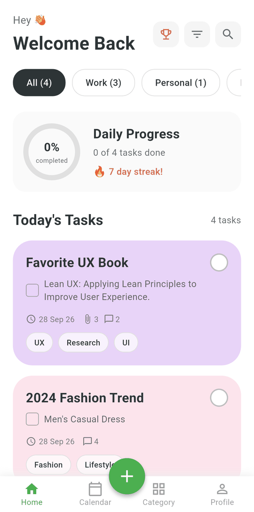
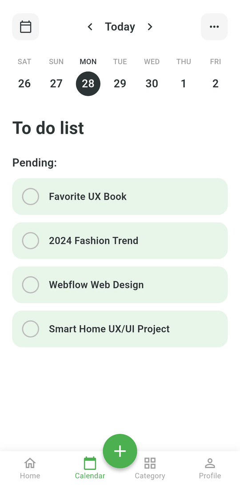
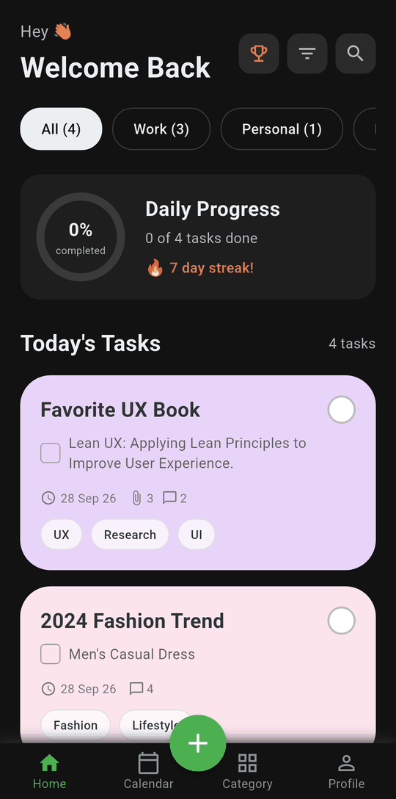
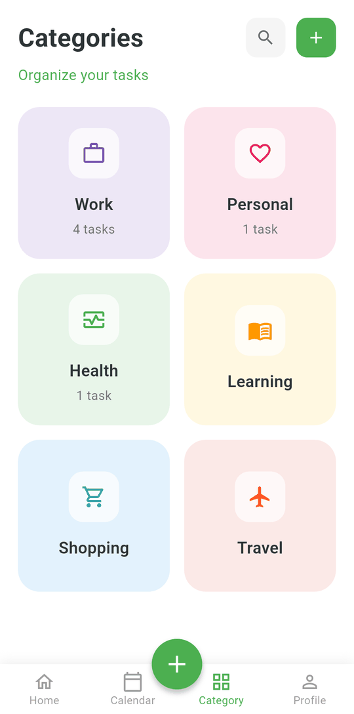
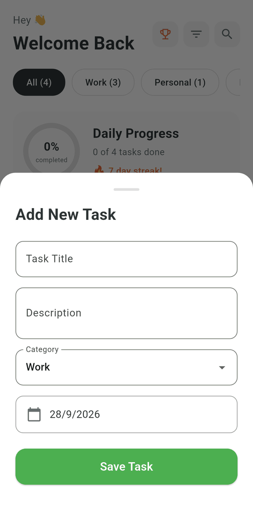
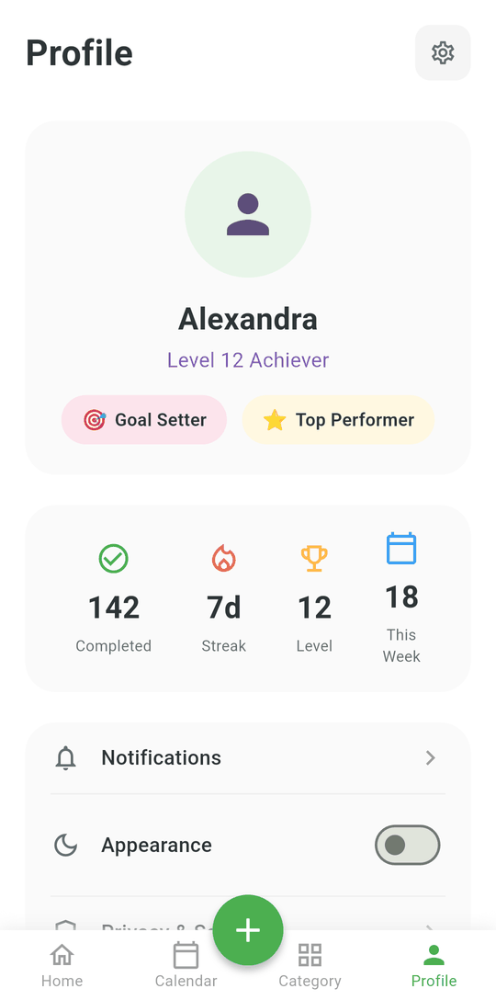
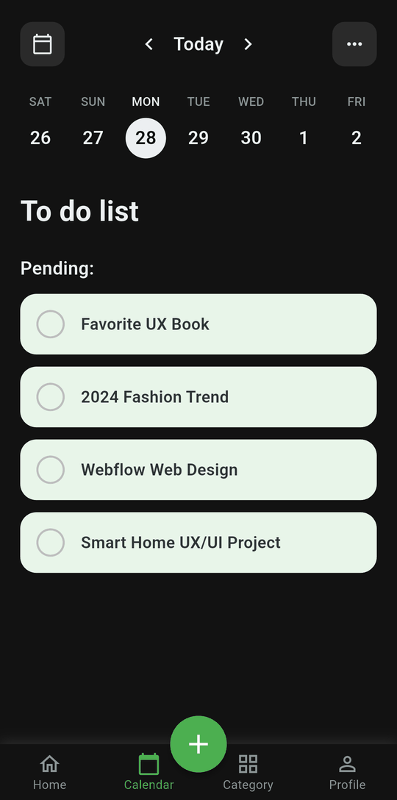
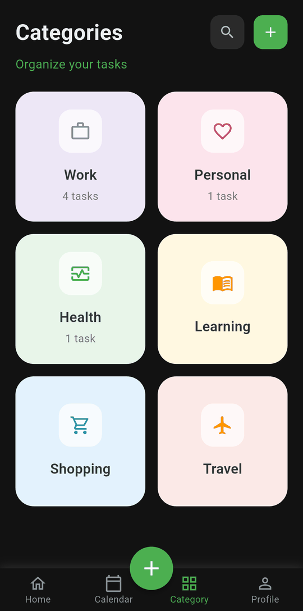
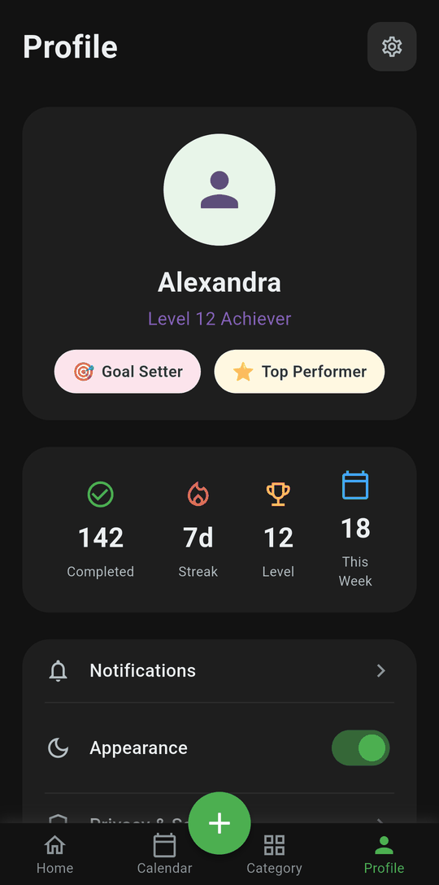

<p align="center">
  
</p>

<h1 align="center">Todo App</h1>

<p align="center">
  Flutter ile geliştirilmiş, pastel renkli kartlar, takvim görünümü ve karanlık mod içeren bir yapılacaklar listesi uygulaması.
</p>

<p align="center">
  
  
  
</p>

<p align="center">
  
  &nbsp;
  
  &nbsp;
  
</p>

---

## İçindekiler

- [Özellikler](#özellikler)
- [Ekranlar](#ekranlar)
- [Karanlık Mod](#karanlık-mod)
- [Kurulum](#kurulum)
- [Derleme ve Telefona Yükleme](#derleme-ve-telefona-yükleme)
- [Testler](#testler)
- [Proje Yapısı](#proje-yapısı)
- [Uygulama Simgesi](#uygulama-simgesi)
- [Bilinen Sınırlamalar](#bilinen-sınırlamalar)

## Özellikler

- **Görev ekleme:** Başlık, açıklama, kategori ve tarih seçerek yeni görev oluşturma.
- **Tamamlandı olarak işaretleme:** Görev kartına dokununca görev tamamlanır ya da tekrar açılır.
- **Günlük ilerleme:** Bugünün görevlerinden kaçının bittiğini yüzde olarak gösteren halka.
- **Kategori filtreleri:** Ana ekranda görevleri Work, Personal, Health ve Learning kategorilerine göre süzme.
- **Takvim:** Haftalık gün şeridi, önceki/sonraki haftaya geçiş ve seçilen güne ait görevler.
- **Kategori özeti:** Her kategoride kaç görev olduğunu gösteren renkli kartlar.
- **Karanlık mod:** Profil ekranından açılıp kapatılır, seçim hatırlanır.
- **Kalıcı veri:** Görevler ve tema tercihi cihazda saklanır, uygulama kapatılıp açılınca kaybolmaz.

## Ekranlar

### Ana Ekran

Karşılama başlığı, kategori filtreleri, günlük ilerleme kartı ve bugünün görevleri. Her görev kartında tarih, ek ve yorum sayısı ile etiketler yer alır. Karta dokunmak görevi tamamlandı olarak işaretler.

<p align="center">
  
</p>

### Takvim

Üstteki oklar haftayı değiştirir, gün şeridinden bir güne dokununca o günün görevleri listelenir. Görevler **Pending** (bekleyen) ve **Completed** (tamamlanan) olarak iki grupta gösterilir.

<p align="center">
  
</p>

### Kategoriler

Her kategori kendi rengi ve simgesiyle gösterilir. Görev sayıları gerçek görev listesinden hesaplanır.

<p align="center">
  
</p>

### Yeni Görev Ekleme

Alt ortadaki **+** düğmesi görev ekleme panelini açar. Başlık zorunludur (sadece boşluktan oluşan başlık kabul edilmez), açıklama isteğe bağlıdır. Tarih bugünden itibaren en fazla bir yıl sonrası olarak seçilebilir.

<p align="center">
  
</p>

### Profil

Kullanıcı kartı, istatistikler ve ayarlar menüsü. **Appearance** anahtarı karanlık modu açıp kapatır.

<p align="center">
  
</p>

## Karanlık Mod

Tüm ekranlar karanlık temayı destekler. Pastel görev ve kategori kartları iki temada da aynı kalır. Arka plan, metin ve kenarlık renkleri temaya göre değişir.

<table>
  <tr>
    <th>Ana Ekran</th>
    <th>Takvim</th>
    <th>Kategoriler</th>
    <th>Profil</th>
  </tr>
  <tr>
    <td></td>
    <td></td>
    <td></td>
    <td></td>
  </tr>
</table>

## Kurulum

### Gereksinimler

| Araç | Sürüm |
|---|---|
| Flutter SDK | 3.47 veya üzeri |
| Dart SDK | 3.9.2 veya üzeri |
| Android için | JDK 17, Android SDK |

Android derlemesi Gradle 8.14.3, Android Gradle Plugin 8.11.1 ve Kotlin 2.2.20 kullanır. Bu sürümler projede zaten tanımlı olduğundan ayrıca bir şey kurmanız gerekmez.

### Çalıştırma

```bash
git clone https://github.com/MuratEfeCamoglu/ToDo-App.git
cd ToDo-App
flutter pub get
flutter run
```

Bağlı cihazları görmek için `flutter devices`, belirli bir cihazda çalıştırmak için `flutter run -d <cihaz-id>` kullanın.

## Derleme ve Telefona Yükleme

```bash
# Release APK oluştur
flutter build apk --release
# Çıktı: build/app/outputs/flutter-apk/app-release.apk

# USB ile bağlı telefona yükle
flutter install --release
```

Her işlemci mimarisi için ayrı ve daha küçük APK dosyaları üretmek için:

```bash
flutter build apk --release --split-per-abi
```

> **Not:** Release sürümü şu an Flutter'ın varsayılan debug anahtarıyla imzalanıyor. Bu APK telefona kurulabilir ama Google Play'e yüklenemez. Store'a çıkmadan önce kendi imza anahtarınızı oluşturup `android/app/build.gradle.kts` dosyasında tanımlamanız gerekir.
>
> Xiaomi (MIUI) cihazlarda USB ile kurulum için Geliştirici Seçenekleri'nde **USB üzerinden yükle** ayarının açık olması gerekir.

## Testler

```bash
flutter analyze
flutter test
```

Widget testleri şunları kontrol eder: alt menüde ekranlar arası geçiş, görev ekleme, boş başlığın reddedilmesi, takvimde hafta değiştirme, karanlık modun açılıp kaydedilmesi ve görevlerin kalıcı olarak saklanması.

## Proje Yapısı

```
ToDo-App/
├── assets/icon/                  # Uygulama simgesinin kaynak görselleri
├── lib/
│   ├── main.dart                 # Başlangıç noktası, tema ve karanlık mod durumu
│   ├── models/
│   │   └── task_model.dart       # Task modeli, JSON dönüşümü, örnek veriler
│   ├── screens/
│   │   ├── main_scaffold.dart    # Alt menü, + düğmesi, görev listesinin sahibi
│   │   ├── home_screen.dart      # Ana ekran
│   │   ├── calendar_screen.dart  # Takvim ekranı
│   │   ├── category_screen.dart  # Kategoriler ekranı
│   │   ├── profile_screen.dart   # Profil ve ayarlar
│   │   └── placeholder_screen.dart
│   ├── services/
│   │   └── task_storage.dart     # shared_preferences ile kayıt/yükleme
│   ├── theme/
│   │   └── app_theme.dart        # Açık/koyu tema renkleri (AppColors)
│   └── widgets/
│       ├── add_task_sheet.dart   # Yeni görev ekleme paneli
│       └── task_tile.dart        # Takvimdeki görev satırı
├── test/
│   └── widget_test.dart
├── docs/screenshots/             # README'deki ekran görüntüleri
├── android/ ios/ web/            # Platform klasörleri
└── linux/ macos/ windows/
```

Görev listesi `MainScaffold` içinde tutulur ve ekranlara parametre olarak aktarılır. Her değişiklikte `TaskStorage` üzerinden cihaza JSON olarak kaydedilir. Tema renkleri `AppColors` adlı bir `ThemeExtension` içinde toplanmıştır; ekranlarda `context.colors.textPrimary` gibi erişilir.

## Uygulama Simgesi

Simge [`flutter_launcher_icons`](https://pub.dev/packages/flutter_launcher_icons) ile üretilir. Simgeyi değiştirmek için `assets/icon/icon.png` (1024×1024) ve Android uyarlanabilir simgesi için `icon_foreground.png` dosyalarını güncelleyip şunu çalıştırın:

```bash
dart run flutter_launcher_icons
```

Ayarlar `pubspec.yaml` içindeki `flutter_launcher_icons` bölümündedir.

## Bilinen Sınırlamalar

Bazı arayüz öğeleri şimdilik yalnızca görseldir:

- Görevler silinemez veya düzenlenemez.
- Profildeki isim, seviye, rozetler ve istatistikler (142 tamamlanan, 7 günlük seri vb.) sabit örnek verilerdir.
- Ana ekrandaki arama, filtre ve kupa düğmeleri ile kategori ekranındaki arama ve **+** düğmeleri henüz bir işlev yapmaz.
- Shopping ve Travel kategorileri görev eklerken seçilemez.
- Notifications, Privacy & Security ve Help & Support sayfaları "Coming Soon" ekranı gösterir; Sign Out gerçek bir oturumu kapatmaz.
- Arayüz metinleri İngilizcedir.

## Lisans

Bu proje kişisel gelişim ve portfolyo çalışmaları kapsamında hazırlanmıştır.
